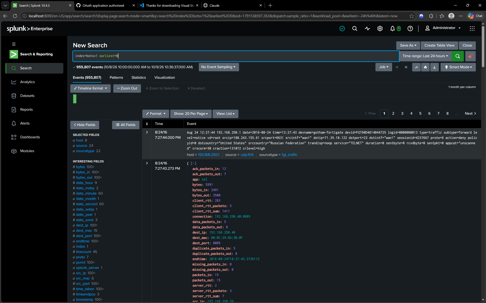
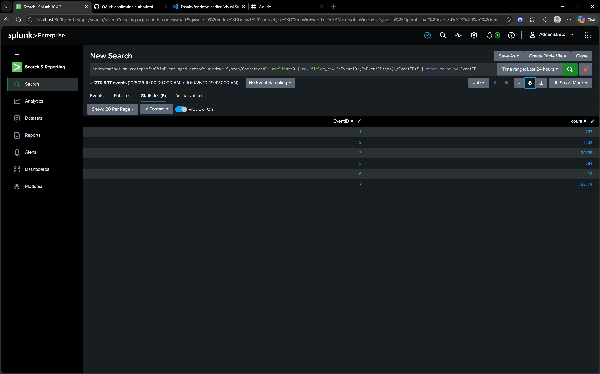
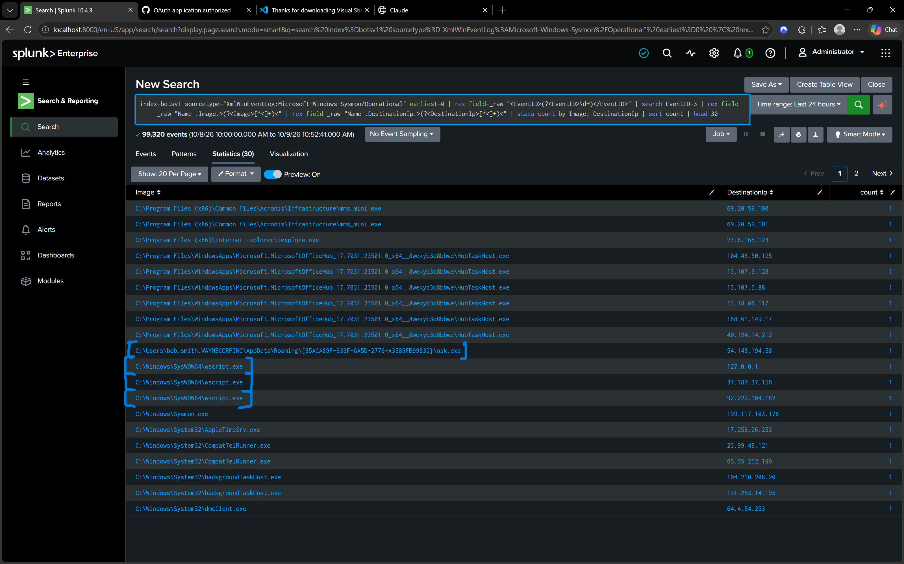
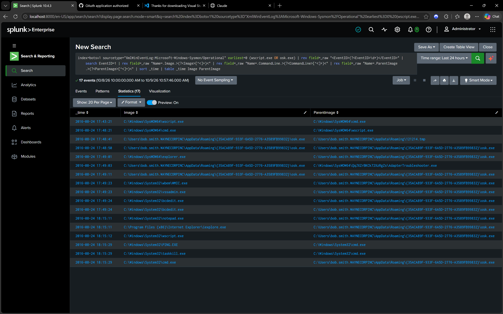
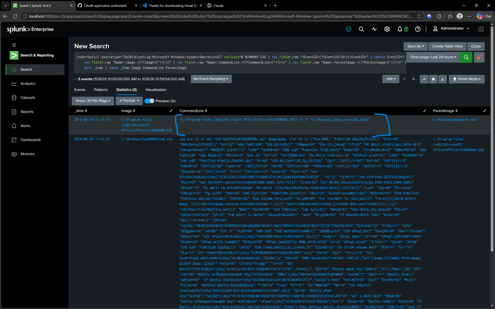
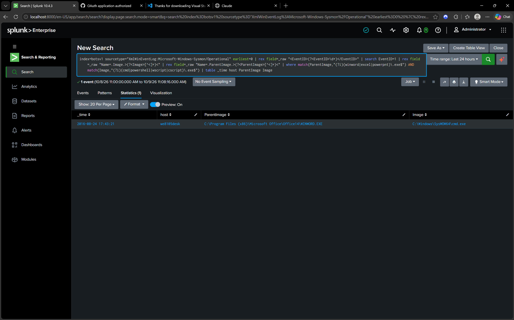
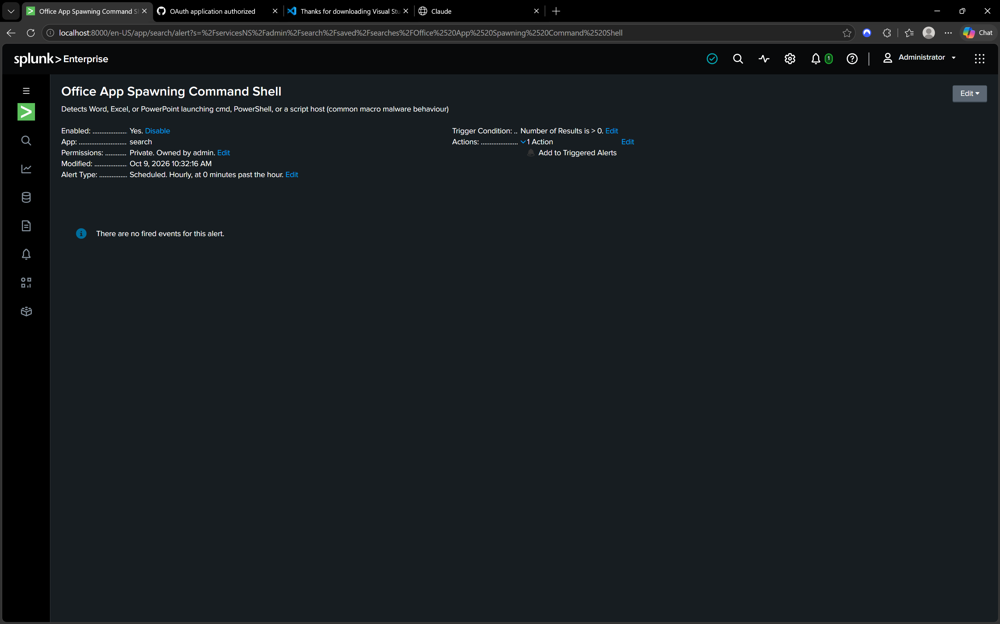

# SOC Triage Lab: Ransomware Investigation with Splunk

A hands-on SOC analyst lab. I investigated the Splunk **Boss of the SOC (BOTS) v1** dataset, found a ransomware infection, traced it back to the entry point, and built a detection for it.

## Project summary
- **Platform:** Splunk Enterprise (local install, Windows)
- **Data:** BOTS v1 attack-only dataset (about 955,000 events: Sysmon, Windows Security, Suricata, firewall, network stream)
- **Scenario:** Wayne Corp Inc, host WE8105DESK, user bob.smith

## What I found
1. **Nessus vulnerability scan activity** (likely benign, needs authorization check)
2. **Ransomware infection** that started with a malicious macro-enabled Word document, dropped a script, deleted shadow copies, showed a ransom note, and then deleted itself

## Detection built
**Office application spawning a command shell:** alerts when Word, Excel, or PowerPoint launches cmd, PowerShell, or a script host. On this dataset, it returned exactly one match, the ransomware entry point, with no false positives. It is saved as a scheduled Splunk alert.

## Documents
- [FINDINGS.md](FINDINGS.md): both findings with evidence and MITRE ATT&CK mapping
- [INCIDENT-REPORT.md](INCIDENT-REPORT.md): full incident report with timeline, IOCs, and recommendations

## Investigation steps
| Step | Screenshot |
|------|-----------|
| Data loaded into Splunk |  |
| Sysmon event types (extracted with regex) |  |
| Suspicious outbound connections |  |
| Ransomware process timeline |  |
| Initial access: malicious Word document |  |
| Detection result |  |
| Saved alert configuration |  |

## Detection query (SPL)
```
index=botsv1 sourcetype="XmlWinEventLog:Microsoft-Windows-Sysmon/Operational" earliest=0 | rex field=_raw "<EventID>(?<EventID>\d+)</EventID>" | search EventID=1 | rex field=_raw "Name=.Image.>(?<Image>[^<]+)<" | rex field=_raw "Name=.ParentImage.>(?<ParentImage>[^<]+)<" | where match(ParentImage,"(?i)(winword|excel|powerpnt)\.exe$") AND match(Image,"(?i)(cmd|powershell|wscript|cscript)\.exe$") | table _time host ParentImage Image
```

## Skills demonstrated
Splunk searching (SPL, rex, stats, where), log analysis (Sysmon and Windows Security), threat hunting, incident triage and investigation, detection engineering, MITRE ATT&CK mapping, incident reporting.

## Limitations
This uses a static 2016 lab dataset, so the alert shows the detection logic rather than live monitoring. The delivery method of the malicious document is unconfirmed, and malware family attribution is tentative.

*Dataset: Splunk BOTS v1 (github.com/splunk/botsv1). Analysis by Yashwanth.*
